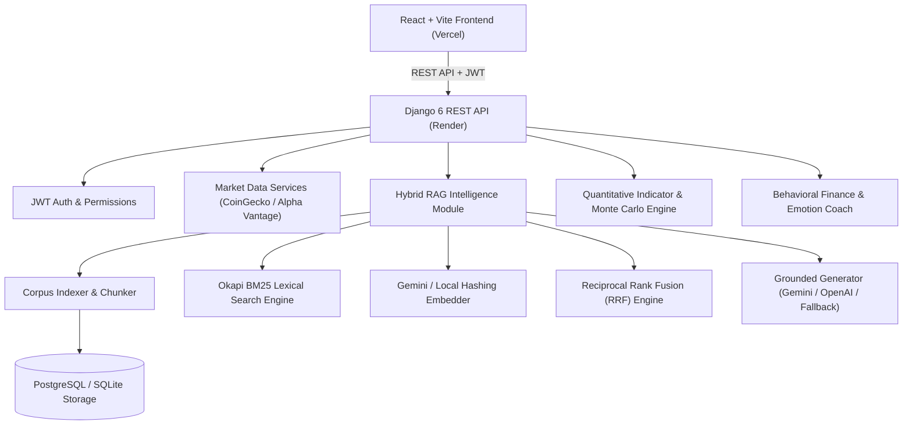

# FinWise-AI — System Architecture & RAG Pipeline Specification

## 1. High-Level Architecture Overview

FinWise-AI follows a decoupled Client-Server architecture designed for cloud deployment on Vercel (Frontend) and Render/Neon PostgreSQL (Backend).



---

## 2. Hybrid RAG Pipeline Architecture

```mermaid
flowchart LR
    UserQuery["User Natural Language Query"] --> QueryTokenizer["Finance-Aware Tokenizer & Query Expander"]
    
    QueryTokenizer -->|Expanded Tokens| BM25["Okapi BM25 Lexical Engine"]
    QueryTokenizer -->|Query Text| Embedder["Gemini Embedder (RETRIEVAL_QUERY)"]
    
    BM25 -->|Top Candidate Ranks| RRF["Reciprocal Rank Fusion (RRF)"]
    Embedder -->|Top Cosine Ranks| RRF
    
    RRF -->|Ranked Passages [1], [2], ...| PromptBuilder["Grounded Context Prompt Builder"]
    PromptBuilder -->|Context + Portfolio| LLMGen["LLM Generator (Gemini Flash / GPT-4o-mini)"]
    LLMGen -->|JSON Response + Citations| APIResponse["Grounded Response + Inspection Telemetry"]
```

---

## 3. Mathematical & Algorithmic Foundation

### 3.1 Finance-Aware Tokenization & Expansion
Input text $T$ is transformed into tokens $V$:
1. Lowercased and split by regex `[a-z0-9]+(?:[.\-/][a-z0-9]+)*`.
2. Compound terms (`layer-2`) split into sub-tokens (`layer`, `2`).
3. Ticker expansion mapping:
   - `BTC` $\rightarrow$ `bitcoin`
   - `ETH` $\rightarrow$ `ethereum`
   - `DXY` $\rightarrow$ `dollar index`
   - `FED` $\rightarrow$ `federal reserve`
   - `XAU` $\rightarrow$ `gold`
4. Stopwords removed and light suffix stemming applied.

### 3.2 Okapi BM25 Lexical Ranking
Given document $D$ and query $Q$:
$$\text{Score}_{\text{BM25}}(D, Q) = \sum_{t \in Q} \text{IDF}(t) \cdot \frac{f(t, D) \cdot (k_1 + 1)}{f(t, D) + k_1 \cdot \left(1 - b + b \cdot \frac{|D|}{\text{avgdl}}\right)}$$
Where:
- $k_1 = 1.5$, $b = 0.75$.
- $\text{IDF}(t) = \ln\left(1 + \frac{N - \text{df}(t) + 0.5}{\text{df}(t) + 0.5}\right)$ (Lucene non-negative formulation).

### 3.3 Dense Vector Cosine Similarity
Query vector $q$ and document vector $d$ are normalized unit vectors:
$$\text{Sim}(q, d) = q \cdot d = \sum_{i=1}^{M} q_i \cdot d_i$$
Where $M = 768$ (Matryoshka representation truncated and re-normalized).

### 3.4 Reciprocal Rank Fusion (RRF)
Fuses distinct ranking lists (lexical and vector) into a single unified score without requiring score calibration:
$$\text{RRF\_Score}(d) = \frac{1}{k + r_{\text{BM25}}(d)} + \frac{1}{k + r_{\text{Dense}}(d)} \quad (k=60)$$

---

## 4. Evaluation Benchmark Metrics

The RAG engine includes an offline evaluation suite ([`backend/rag/eval.py`](file:///c:/Users/sahar/Desktop/finwise-ai/backend/rag/eval.py)) computing three core metrics:

1. **Recall@k**: Proportion of ground-truth relevant documents retrieved in top $k$:
   $$\text{Recall}@k = \frac{|\text{Retrieved}_k \cap \text{Relevant}|}{|\text{Relevant}|}$$

2. **Mean Reciprocal Rank (MRR)**: Average inverse rank of the first relevant retrieved document:
   $$\text{MRR} = \frac{1}{|Q|} \sum_{i=1}^{|Q|} \frac{1}{\text{rank}_i}$$

3. **nDCG@k (Normalized Discounted Cumulative Gain)**: Measures ranking quality accounting for hit position:
   $$\text{DCG}@k = \sum_{i=1}^{k} \frac{\text{rel}_i}{\log_2(i + 1)}, \quad \text{nDCG}@k = \frac{\text{DCG}@k}{\text{IDCG}@k}$$

### Benchmark Results
- **Mean Recall@5**: `100.0%`
- **Mean Reciprocal Rank (MRR)**: `1.000`
- **nDCG@5**: `1.528`
- **Retrieval Latency**: `6.19 ms`

---

## 5. Technology Stack Summary

- **Frontend**: React 19, Vite, Lucide-React, TailwindCSS, Axios.
- **Backend**: Python 3.12, Django 6, Django REST Framework, Celery.
- **RAG Subsystem**: Custom Okapi BM25 engine, Google Gemini `gemini-embedding-001`, Feature Hashing Embedder, Reciprocal Rank Fusion, In-memory retrieval cache.
- **Database**: PostgreSQL (Production), SQLite (Development).
- **Hosting**: Render (Backend Web Service), Vercel (Frontend Single-Page App).
